# Bangkit Academy 2023 Batch 1 Capstone Project

**Team ID** : `C23-PS249`

## Overview

The android application that we designed with the theme of human health and well-being focuses on analyzing skincare ingredients that can cause fungal acne. This application will provide information about identifying ingredients that can cause fungal acne, so users can avoid products with ingredients that can cause fungal acne. This app will help users choose their skin health products better.

## Contributors

- (**ML**) `M368DSX2830` | **Made Radipta Dwi Prabawa** – Universitas Udayana
- (**ML**) `M368DSY0120` | **Ida Ayu Agung Diah Janawati** – Universitas Udayana
- (**CC**) `C243DSX0644` | **Edwin Tantawi** – Universitas Mikroskil
- (**CC**) `C350DSY3018` | **Puan Abidah Nitisara** – Universitas Sumatera Utara
- (**MD**) `A028DSX1163` | **I Putu Wira Budhi Guna Ariyasa** – Institut Teknologi dan Bisnis STIKOM Bali
- (**MD**) `A350DSY1709` | **Zefania Agustina Lumbangaol** – Universitas Sumatera Utara

## App Screenshots
     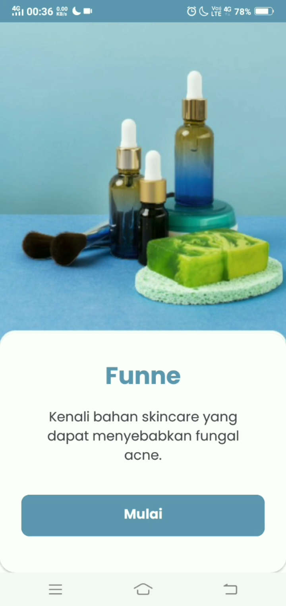     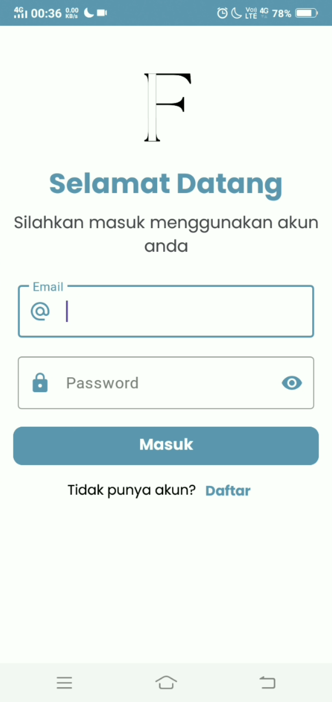
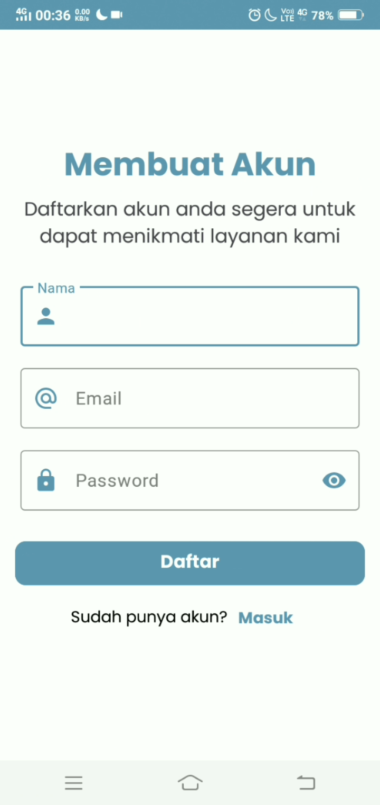     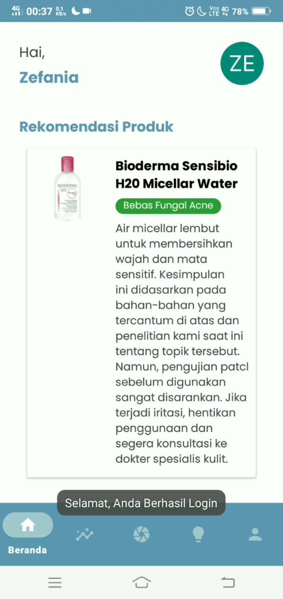     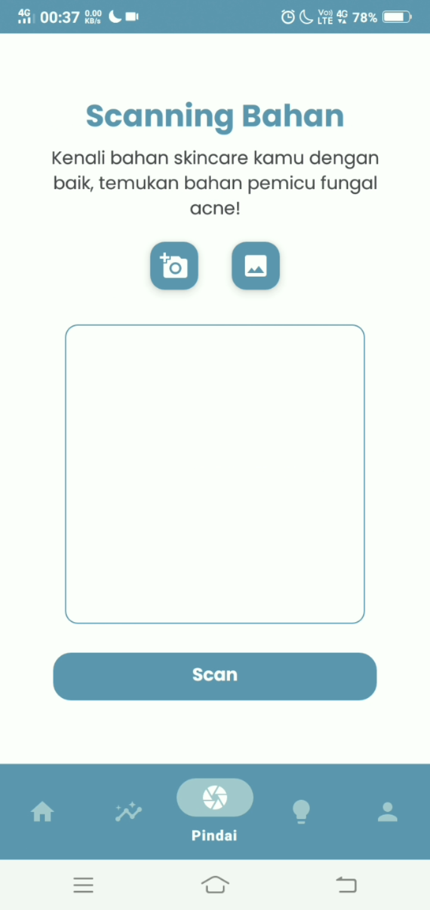
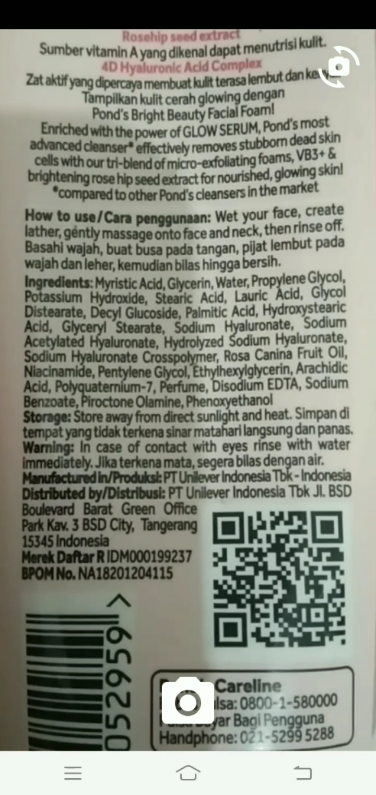     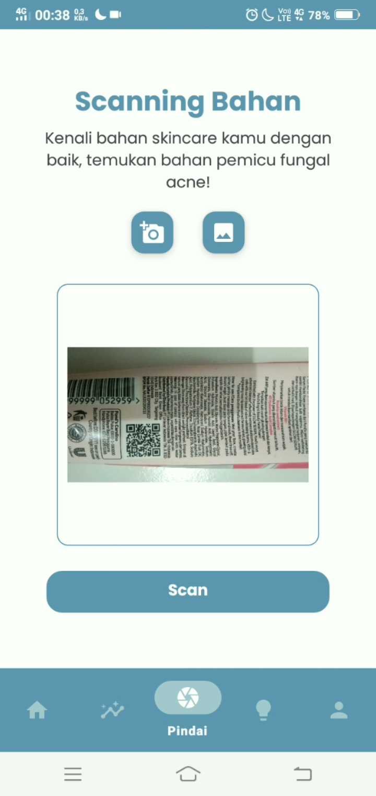     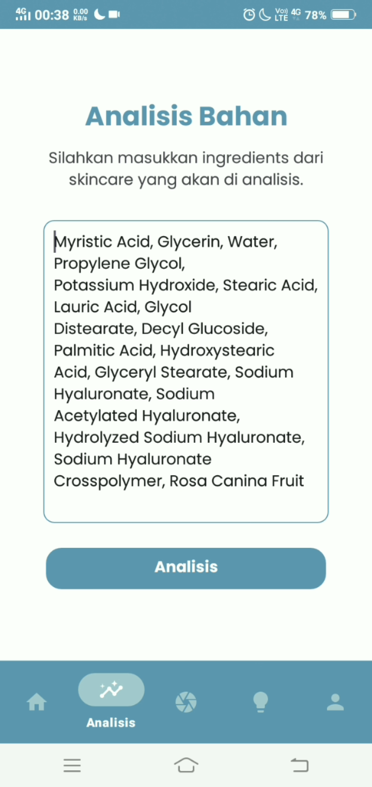
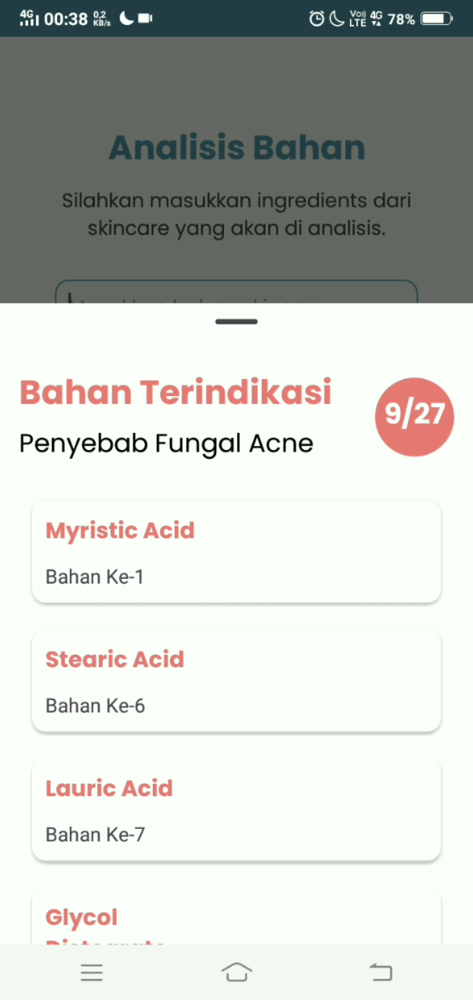     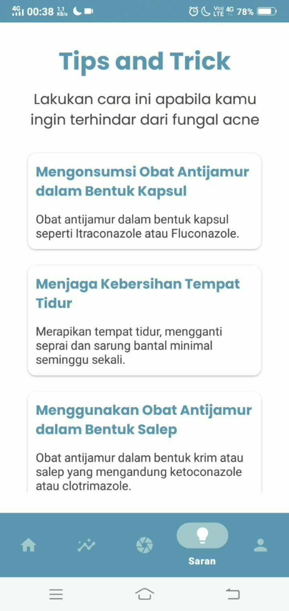     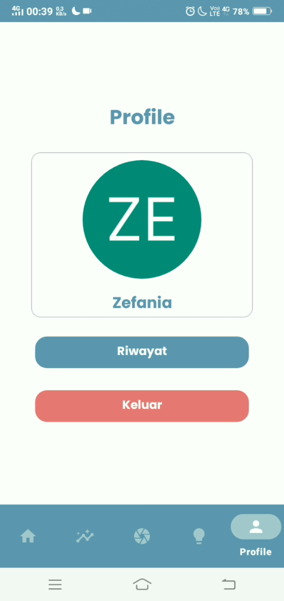
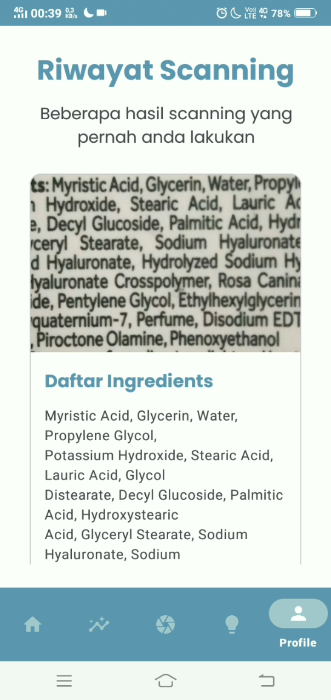
